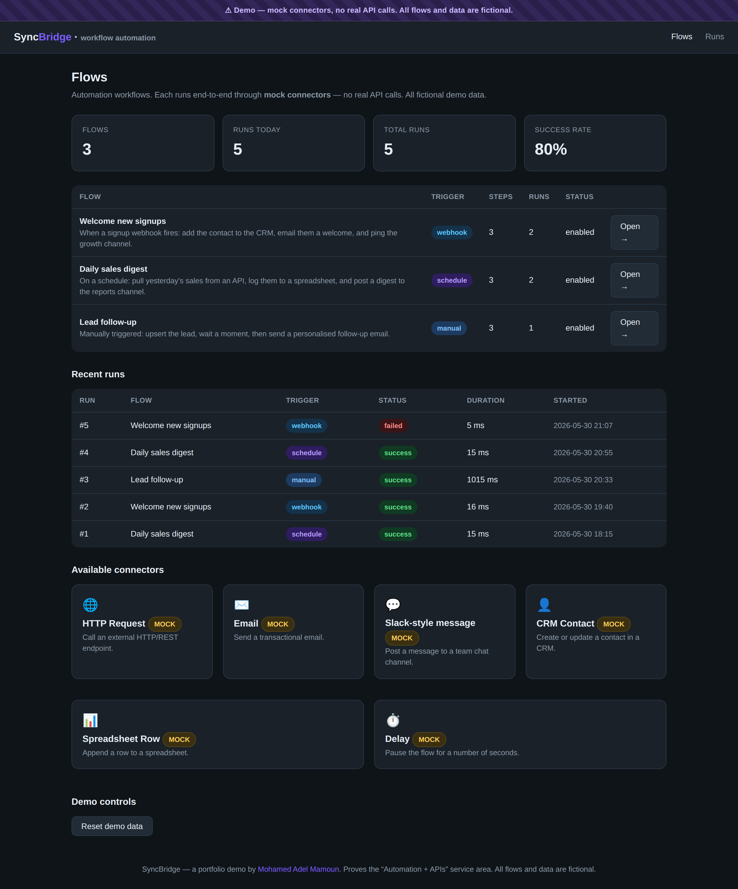
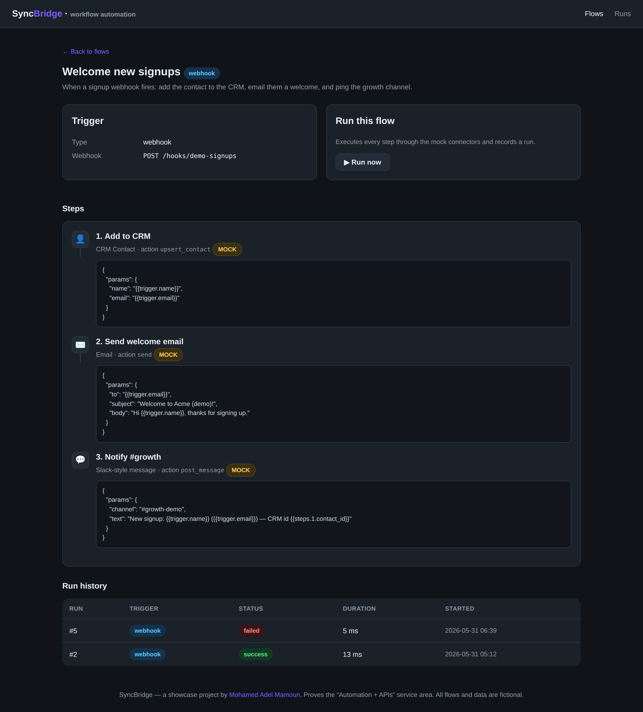
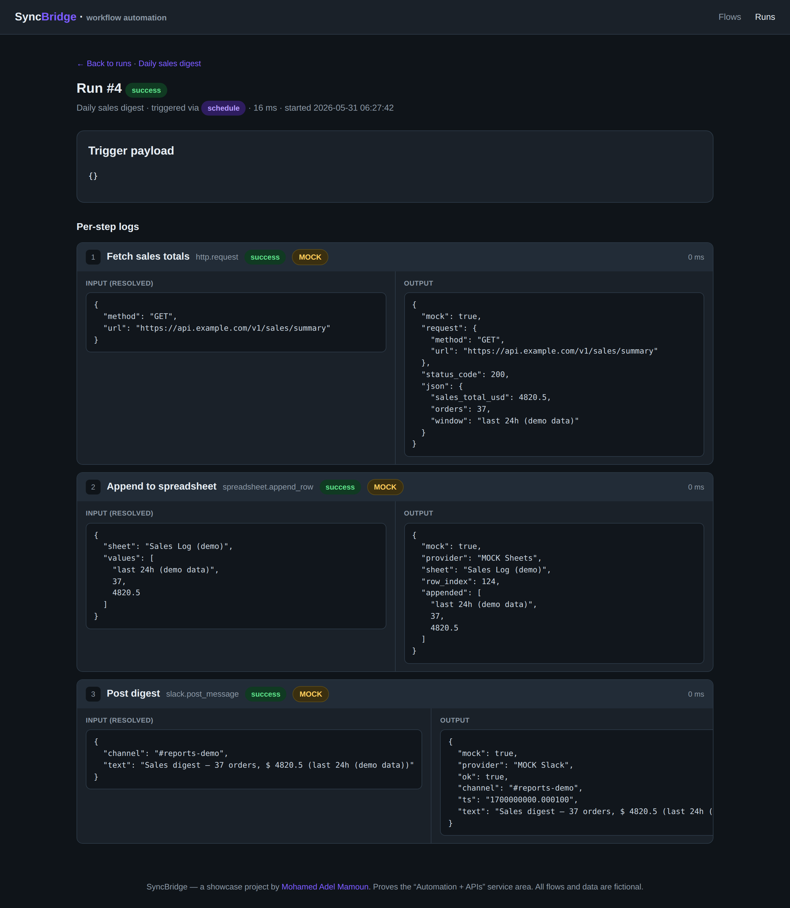

# SyncBridge — Automation + APIs

> A tiny, honest **workflow-automation engine** (think a mini Zapier / n8n): define **flows** of ordered **steps**, each calling a **connector** with field-mapping from previous steps' output. Flows are triggered **manually, on a schedule, or by an inbound webhook**, every run is recorded with **per-step logs** (resolved input, output, status, timing), and there's a full **REST API**. It runs **100% offline with zero config** — every connector is a **MOCK** that returns believable fake responses, so nothing ever hits the network.

[](https://www.python.org)
[](https://fastapi.tiangolo.com)
[](https://apscheduler.readthedocs.io)
[](https://www.sqlite.org)
[](./LICENSE)

SyncBridge proves the **Automation + APIs** service area: the kind of glue that wires a business's tools together — "when X happens, do A then B then C" — with a clean REST API to drive it and an audit trail of every run. **Everything is fake by construction** — fictional flows, `example.com` addresses, sample channels, and `MOCK`-labelled connectors, so no real API calls are ever made.

---

## Screenshots



| Flow detail (steps + field mapping) | Run logs (per-step input/output) |
| --- | --- |
|  |  |

---

## What it proves

A genuine automation engine + API, not a mockup:

1. **A real execution engine.** [`syncbridge/engine.py`](syncbridge/engine.py) runs each step in order, **resolves field-mapping templates** (`{{trigger.email}}`, `{{steps.1.contact_id}}`) against the trigger payload and earlier steps' outputs, and records a `run` plus one `run_log` per step with the *resolved* input, the output, status and timing. A failing step marks the run failed and halts the rest — exactly like a real engine.
2. **Three trigger types.** **Manual** ("Run now" / API), **schedule** (APScheduler fires it on an interval), and **inbound webhook** (`POST /hooks/{key}` with a JSON body that becomes the trigger payload).
3. **Six connectors, all MOCK by default.** HTTP request, Email, Slack-style message, CRM contact, Spreadsheet row, and Delay. Each **validates its inputs** and returns a believable fake response without any network call. The live-connector branch point is shown in [`connectors.py`](syncbridge/connectors.py) but is never taken (`SYNCBRIDGE_LIVE_CONNECTORS=false`).
4. **A documented REST API** (the "APIs" half) — list/create flows, trigger runs, and fetch runs + logs (see below).
5. **Honest run history.** It seeds three fictional flows and then **actually executes them** through the mock engine to produce real logs — including one genuinely **failed** run (a signup webhook that arrived without an email address, so the CRM step fails validation), giving an honest success-rate KPI.

## Connectors (all MOCK by default)

| Connector | Action | Returns (mock) |
| --- | --- | --- |
| 🌐 HTTP Request | `request` | status code + a canned JSON body |
| ✉️ Email | `send` | message id + accepted recipients |
| 💬 Slack-style message | `post_message` | ok + channel + timestamp |
| 👤 CRM Contact | `upsert_contact` | contact id + created flag |
| 📊 Spreadsheet Row | `append_row` | sheet + row index |
| ⏱️ Delay | `wait` | seconds waited (capped at 1s) |

## Tech stack

**Python** · **FastAPI** + **Uvicorn** (UI, REST API, webhook) · **Jinja2** (server-rendered HTML) · **APScheduler** (scheduled flows) · **SQLite** (`sqlite3`, no ORM). No API keys, no network required.

```
syncbridge/
├── app.py                      # FastAPI: HTML UI + REST API + webhook
├── syncbridge/
│   ├── engine.py               # the executor: field mapping, per-step logs
│   ├── connectors.py           # 6 MOCK connectors (+ live branch point)
│   ├── scheduler.py            # APScheduler — runs scheduled flows
│   ├── db.py                   # SQLite schema, queries, seed (runs real flows)
│   ├── config.py               # zero-config defaults
│   ├── templates/              # flows, flow detail, runs, run logs
│   └── static/style.css
├── tools/
│   ├── smoke.py                # end-to-end engine check (no server)
│   └── shoot.py                # screenshot capture (Playwright)
└── docs/screenshots/
```

## Quick start (zero-config)

```bash
git clone git@github.com:MoAdelMamoun/syncbridge.git
cd syncbridge

python -m venv .venv && source .venv/bin/activate   # Windows: .venv\Scripts\activate
pip install -r requirements.txt

uvicorn app:app --reload      # open http://localhost:8000
```

That's it — no keys, no network. You land on the **Flows** dashboard with seeded history. Open a flow and hit **Run now**, or watch the scheduled "Daily sales digest" flow fire on its own. Then open any run to see the **per-step logs**.

Sanity-check the engine without the web server:

```bash
python tools/smoke.py
```

> Note: when you run with `--reload`, the dev server starts the scheduler in each worker. That's fine locally; for production run without `--reload`.

## REST API

All responses are JSON. The interactive docs are at **`/docs`** (FastAPI/Swagger).

| Method & path | Description |
| --- | --- |
| `GET /api/flows` | List all flows (with their steps). |
| `GET /api/flows/{id}` | Get one flow incl. full step config. |
| `POST /api/flows` | Create a flow with steps (body below). |
| `POST /api/flows/{id}/run` | Trigger a run. Optional JSON body becomes the trigger payload. Returns the run + logs. |
| `GET /api/runs` | List runs (`?flow_id=` and `?limit=` optional). |
| `GET /api/runs/{id}` | Get one run with its per-step logs. |
| `POST /hooks/{webhook_key}` | **Inbound webhook** — triggers the flow whose `webhook_key` matches; the JSON body is the trigger payload. |

**Trigger a run:**

```bash
curl -X POST http://localhost:8000/api/flows/3/run \
  -H 'Content-Type: application/json' -d '{"name":"Globex Inc","email":"lead@example.com"}'
```

**Fire the seeded inbound webhook:**

```bash
curl -X POST http://localhost:8000/hooks/demo-signups \
  -H 'Content-Type: application/json' -d '{"name":"Wayne Enterprises","email":"signup@example.com"}'
```

**Create a flow:**

```bash
curl -X POST http://localhost:8000/api/flows -H 'Content-Type: application/json' -d '{
  "name": "Notify on new lead",
  "trigger_type": "manual",
  "steps": [
    {"name": "Ping Slack", "connector": "slack", "action": "post_message",
     "params": {"channel": "#sales-demo", "text": "New lead: {{trigger.name}}"}}
  ]
}'
```

Field mapping uses `{{trigger.<field>}}` and `{{steps.<position>.<field>}}` anywhere inside a step's `params`.

## Configuration (full / live version — optional)

It needs nothing to run. To wire up real connectors, copy `.env.example` to `.env`:

| Variable | Purpose |
| --- | --- |
| `SYNCBRIDGE_LIVE_CONNECTORS` | Master switch. **`false` by default → all connectors MOCK.** Set `true` only once you've implemented the live connector code paths. |
| `SYNCBRIDGE_DB_PATH` | Where the SQLite file lives. |
| `SYNCBRIDGE_ENABLE_SCHEDULER` | Start the background scheduler with the app (default `true`). |

To add a real integration: implement the live call inside the relevant connector in `syncbridge/connectors.py` (branching on `config.LIVE_CONNECTORS`), read its credentials from the environment, and the rest of the engine, API and UI work unchanged.

## Deploy

Because it makes no external calls, it's safe to host publicly:

- **Any container/VM** — `pip install -r requirements.txt && uvicorn app:app --host 0.0.0.0 --port $PORT`.
- **Fly.io / Render / Railway** — point the start command at `uvicorn app:app`; attach a volume for the SQLite file if you want runs to persist across redeploys.

## Author

Built by **Mohamed Adel Mamoun** — full-stack developer.
🌐 [mohamedadelmamoun.com](https://mohamedadelmamoun.com)

One of a series of open-source portfolio projects, each proving a service area. SyncBridge proves **Automation + APIs**.

## License

[MIT](./LICENSE)
